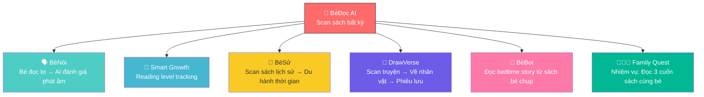

# 🎯 Chiến Lược Sản Phẩm AI Vision Cho Giáo Dục — Phân Tích Sâu

## Tổng Quan: Tại Sao AI Vision Là "Vũ Khí Hạt Nhân" Cho EdTech?

Trong 5 tính năng AI Vision đã đề xuất (BéViết, BéVận Động, BéAnToàn, BéĐọc, BéToán), câu hỏi cốt lõi là: **Tính năng nào tạo ra giá trị giáo dục CAO NHẤT, giúp cộng đồng NHIỀU NHẤT, và khả thi nhất để triển khai trong dự án KidFit?**

Tôi sẽ phân tích qua 3 lăng kính:
1. **Giá trị giáo dục thực chất** (không chỉ "cool tech")
2. **Lợi ích cộng đồng tối ưu** (giúp được nhiều người nhất)
3. **Khả thi trong bối cảnh EXE101** (resource 2 người, timeline ngắn)

---

## 🏆 Kết Luận Chiến Lược: NÊN TẬP TRUNG VÀO 1 SẢN PHẨM DUY NHẤT

> [!IMPORTANT]
> **Sản phẩm được đề xuất: "BéĐọc AI" — AI-Powered Interactive Reading**
> 
> Đây là tính năng tạo ra **lợi ích giáo dục cao nhất + phục vụ cộng đồng rộng nhất** trong tất cả 5 tính năng vision, đồng thời nằm trong khả năng triển khai của dự án.

### Tại sao BéĐọc AI, không phải tính năng khác?

Tôi phân tích từng lý do chi tiết:

---

## 📊 Bảng So Sánh Đa Chiều — 5 Tính Năng Vision

| Tiêu chí | BéViết ✍️ | BéVận Động 🤸 | BéAnToàn 🛡️ | BéĐọc 📖 | BéToán 🔢 |
|:---|:---:|:---:|:---:|:---:|:---:|
| **Giá trị giáo dục lâu dài** | ⭐⭐⭐⭐ | ⭐⭐⭐ | ⭐⭐ | ⭐⭐⭐⭐⭐ | ⭐⭐⭐⭐ |
| **Số trẻ được hưởng lợi** | Trẻ 4-8 | Trẻ 3-8 | Trẻ MN | **Trẻ 3-12 TẤT CẢ** | Trẻ 3-12 |
| **Giải quyết pain point thực** | 🟡 Có nhưng niche | 🟡 Thể dục | 🟢 An toàn B2B | 🟢 **RẤT LỚN** | 🟡 Có |
| **Khoảng trống thị trường VN** | 🔴 Blue ocean | 🔴 Blue ocean | 🔴 Blue ocean | 🔴 **Blue ocean** | 🟡 Semi-blue |
| **Effort triển khai** | 🟡 TB | 🟡 TB | 🔴 Rất cao | 🟢 **Thấp-TB** | 🟢 Thấp |
| **Reuse pipeline hiện có** | 70% | 30% | 20% | **90%** | 85% |
| **AI cost/request** | Thấp | FREE | TB | **Thấp** | Thấp |
| **Tính bền vững (dùng lâu dài)** | ⭐⭐⭐ | ⭐⭐⭐ | ⭐⭐⭐⭐ | ⭐⭐⭐⭐⭐ | ⭐⭐⭐⭐ |
| **Viral potential (PH share)** | ⭐⭐⭐ | ⭐⭐⭐ | ⭐⭐ | ⭐⭐⭐⭐⭐ | ⭐⭐⭐⭐ |
| **Serve cộng đồng rộng** | Trẻ viết tay | Trẻ vận động | Trường MN | **MỌI trẻ em VN** | Trẻ học toán |

---

## 🔍 Phân Tích Chi Tiết: Tại Sao BéĐọc AI Là Tối Ưu Nhất

### 1. 📚 Giải Quyết Pain Point LỚN NHẤT Của Giáo Dục Việt Nam

```
                    KIM TỰ THÁP NHU CẦU GIÁO DỤC
                    
                         /\
                        /  \  Sáng tạo (BéVẽ, DrawVerse)
                       /    \
                      /------\  Vận động (BéVận Động)
                     /        \
                    /----------\  Toán/Logic (BéToán)
                   /            \
                  /--------------\  An toàn (BéAnToàn)
                 /                \
                /==================\  ĐỌC HIỂU — NỀN TẢNG CỦA MỌI THỨ
               /                    \
              /======================\  BIẾT CHỮ — NỀN TẢNG CỐT LÕI
```

> [!NOTE]
> **"Đọc" là kỹ năng NỀN TẢNG** cho TẤT CẢ các môn học khác. Trẻ không đọc được → không học được Toán, Sử, Khoa học.
> UNESCO gọi literacy là "mẹ của mọi kỹ năng" — vì vậy, đầu tư vào đọc = đầu tư có ROI giáo dục cao nhất.

#### Thực trạng Việt Nam:

| Vấn đề | Dữ liệu thực tế | BéĐọc AI giải quyết |
|:---|:---|:---|
| **Trẻ không thích đọc sách** | Theo khảo sát VN, trung bình PH đọc cho con 2 phút/ngày — thấp nhất ASEAN | AI đọc thay PH, biến sách thành trò chơi → trẻ TỰ muốn đọc |
| **PH không có thời gian đọc cùng** | 78% PH công nhân/văn phòng kiệt sức sau giờ làm | AI narrator voice đọc cho bé 24/7, PH chỉ chụp 1 trang sách |
| **Sách VN thiếu tương tác** | 95% sách trẻ em VN = giấy truyền thống, không digital supplement | BéĐọc biến BẤT KỲ cuốn sách nào → bài học tương tác |
| **Chênh lệch thành thị / nông thôn** | Trẻ nông thôn có ít sách hơn 5-10 lần so với thành thị | 1 smartphone + BéĐọc = thư viện tương tác vô hạn |
| **Thiếu GV đọc hiểu chuyên sâu** | MN/TH: 1 GV / 35-45 HS, không thể kèm từng em | AI assessment reading level từng trẻ, cá nhân hóa |

### 2. 🌍 Phục Vụ Cộng Đồng Rộng Nhất

```
    BéViết: ━━━━━━━━━░░░░░░░░░░░░  (Trẻ 4-8, đang tập viết)
 BéVậnĐộng: ━━━━━━━━━━░░░░░░░░░░  (Trẻ 3-8, có không gian)
  BéAnToàn: ━━━░░░░░░░░░░░░░░░░░  (Chỉ trường MN có camera)
    BéĐọc: ━━━━━━━━━━━━━━━━━━━━  (MỌI trẻ 3-12 có sách + điện thoại)
    BéToán: ━━━━━━━━━━━━━━━░░░░░  (Trẻ 3-12, nhưng niche hơn)
    
    ▲ Thanh đầy = % trẻ em VN có thể sử dụng ngay
```

**Lý do BéĐọc có diện phục vụ rộng nhất:**
- ✅ Không cần thiết bị đặc biệt (điện thoại + sách bất kỳ)
- ✅ Mọi gia đình đều có ít nhất vài cuốn sách trẻ em
- ✅ Phù hợp TẤT CẢ lứa tuổi 3-12 (chỉ đổi mode đọc)
- ✅ Cả nhà có thể dùng, không chỉ 1 người
- ✅ GV dùng cho cả lớp (kết nối thư viện trường)
- ✅ Hoạt động offline-partial (sau khi scan, quiz đã cache)

### 3. 🧬 Tích Hợp Sâu Với Hệ Sinh Thái Hiện Có



> BéĐọc là tính năng có **interconnectivity cao nhất** — nó kết nối và cung cấp data cho 6/7 tính năng khác trong ecosystem. Đây là "nút trung tâm" thực sự.

### 4. 💡 Kỹ Thuật — Reuse 90% Pipeline Hiện Có

| Component cần | Đã có trong KidFit? | Chi tiết |
|:---|:---:|:---|
| **Gemini Vision (OCR tiếng Việt)** | ✅ Có | Đang dùng cho BéVẽ, BéKhámPhá |
| **Gemini Text (tạo bài học/quiz)** | ✅ Có | Đang dùng cho Story Agent |
| **Text-to-Speech (đọc sách)** | ✅ Có | Web Speech API đã implement |
| **Speech-to-Text (bé đọc to)** | ✅ Có | Đang dùng cho BéNói |
| **File Upload (chụp sách)** | ✅ Có | Multer đã setup, camera API đã có |
| **React UI** | ✅ Có | Component library sẵn |
| **Highlight sync engine** | ❌ Mới | Cần build karaoke-style text highlight |
| **Reading assessment logic** | ❌ Mới | Prompt engineering cho assessment |

> [!TIP]
> **Chỉ cần build 2 thứ hoàn toàn mới:** highlight sync + reading assessment prompts.
> Tất cả infrastructure còn lại đã có sẵn trong codebase hiện tại.

---

## 🛠️ Đề Xuất Sản Phẩm Cụ Thể: "BéĐọc AI" MVP

### Tầm Nhìn Sản Phẩm

> **"Biến bất kỳ cuốn sách nào thành bài học tương tác AI — chỉ bằng 1 bức ảnh chụp."**

### 4 Chế Độ Cốt Lõi (Priorities Cho EXE101 Demo)

````carousel
### 👂 Mode 1: "Nghe Đọc" (3-4 tuổi)
```
📸 Chụp trang sách
       ↓
👁️ Gemini Vision: OCR text tiếng Việt + nhận diện hình
       ↓
🔊 AI đọc to với giọng sinh động
   → Từng từ HIGHLIGHT khi đọc (karaoke style)
   → Bé nhìn theo, học liên kết chữ ↔ âm thanh
       ↓
🎨 "Trong trang này có con gì? Chạm vào nó!"
   → AI tạo mini-game từ hình minh họa
```

**Giá trị giáo dục:** Phonemic awareness, print awareness, vocabulary exposure
<!-- slide -->
### 🗣️ Mode 2: "Bé Đọc" (5-7 tuổi)  
```
📸 Chụp trang sách
       ↓
🎤 Bé TỰ đọc to → AI nghe (Web Speech API STT)
       ↓
🤖 AI đánh giá:
   ┌──────────────────────────────────────┐
   │ ✅ "hiệp sĩ" — phát âm rõ          │
   │ ⚠️ "dũng cảm" — chưa rõ dấu ngã    │  
   │ ✅ "lâu đài" — tốt lắm!            │
   │ 🔁 Gợi ý: Đọc lại từ "dũng cảm"   │
   └──────────────────────────────────────┘
       ↓
🏆 "Con đọc được 85% từ! Giỏi hơn tuần trước 10%! 🎉"
```

**Giá trị giáo dục:** Fluency, pronunciation, self-correction
<!-- slide -->
### 🧠 Mode 3: "Đọc Hiểu" (6-12 tuổi)
```
📸 Chụp trang sách (truyện, bài khoa học, bài thơ...)
       ↓
📖 AI tóm tắt nội dung + hỏi câu hỏi:
   
   Cấp 1 (ghi nhớ):
   "Nhân vật chính tên gì?"
   
   Cấp 2 (hiểu):  
   "Tại sao cô bé lại buồn?"
   
   Cấp 3 (phân tích):
   "Con nghĩ câu chuyện muốn dạy điều gì?"
   
   Cấp 4 (sáng tạo):
   "Nếu con là nhân vật, con sẽ làm gì khác?"
       ↓
🌟 Bloom's Taxonomy tự động → AI điều chỉnh độ khó theo level bé
```

**Giá trị giáo dục:** Reading comprehension, critical thinking, inference
<!-- slide -->
### 🌍 Mode 4: "Song Ngữ" (Premium)
```
📸 Chụp trang sách tiếng Việt
       ↓
🇻🇳 "Ngày xưa, có một chàng hoàng tử dũng cảm..."
       ↓
🇬🇧 "Once upon a time, there was a brave prince..."
       ↓
📝 Vocabulary Cards:
   ┌─────────────────┐
   │ dũng cảm = brave│
   │ hoàng tử = prince│
   │ lâu đài = castle │
   └─────────────────┘
   → Phát âm AI cho từng từ 🔊
       ↓
🃏 Mini flashcard quiz: "brave nghĩa là gì?"
```

**Giá trị giáo dục:** Bilingual development, vocabulary acquisition, cross-linguistic awareness
````

---

## 📈 Tác Động Giáo Dục — Tại Sao Cộng Đồng Được Hưởng Lợi Tối Ưu

### Chuỗi Giá Trị BéĐọc

```
┌─────────────────────────────────────────────────────────────────┐
│                    CHUỖI GIÁ TRỊ BéĐọc AI                       │
│                                                                   │
│  🏠 Ở NHÀ                    🏫 Ở TRƯỜNG                       │
│  ┌─────────────────┐         ┌─────────────────────────┐       │
│  │ PH chụp sách    │         │ GV scan thư viện lớp    │       │
│  │ → AI đọc cho bé │         │ → Thư viện số tương tác │       │
│  │ → Bé tự đọc     │         │ → 35 HS đều có sách số  │       │
│  │ → Quiz AI       │         │ → Report đọc từng HS    │       │
│  └────────┬────────┘         └────────────┬────────────┘       │
│           │                               │                     │
│           └───────────┬───────────────────┘                     │
│                       ▼                                          │
│            ┌─────────────────────┐                               │
│            │ 🧠 Smart Growth      │                               │
│            │ Reading Level Track  │                               │
│            │ → "Bé đang ở Level 3│                               │
│            │   Cần luyện thêm    │                               │
│            │   đọc hiểu"         │                               │
│            └─────────┬───────────┘                               │
│                      ▼                                           │
│         ┌──────────────────────────┐                             │
│         │ 📊 Output Cuối Cùng       │                             │
│         │ • Reading Report PDF      │                             │
│         │ • Gợi ý sách tiếp theo    │                             │
│         │ • Vocabulary growth chart  │                             │
│         │ • Bilingual progress       │                             │
│         └──────────────────────────┘                             │
└─────────────────────────────────────────────────────────────────┘
```

### Đối tượng được hưởng lợi

| Đối tượng | Lợi ích cụ thể | Ước tính quy mô |
|:---|:---|:---|
| **Trẻ em 3-12** | AI đọc sách, quiz tương tác, học từ vựng song ngữ | ~8 triệu trẻ VN trong độ tuổi |
| **Phụ huynh bận rộn** | AI thay PH đọc sách cho con + report tiến độ | ~5 triệu gia đình |
| **GV mầm non / tiểu học** | Biến thư viện trường → thư viện số tương tác | ~200.000 GV |
| **Trẻ nông thôn** | 1 điện thoại + sách bất kỳ = thư viện AI | ~3 triệu trẻ thiếu tiếp cận |
| **Trẻ khuyết tật nhẹ** | AI đọc to + highlight → hỗ trợ trẻ đọc khó (dyslexia) | ~200.000 trẻ |

> [!IMPORTANT]
> **BéĐọc AI giải quyết vấn đề BÌNH ĐẲNG GIÁO DỤC:** 
> Trẻ nông thôn có ít sách nhưng ĐA SỐ gia đình có smartphone. 
> Chỉ cần mượn 1 cuốn sách ở thư viện + chụp ảnh → AI biến thành bài học tương tác.
> **Đây là cách dân chủ hóa giáo dục bằng AI thực sự.**

---

## ⚖️ Tại Sao KHÔNG Ưu Tiên Các Tính Năng Khác

### ❌ BéVận Động AI (Pose Estimation)
- **Hạn chế:** Cần không gian rộng + camera nhìn toàn thân → khó dùng ở không gian nhỏ
- **Giá trị giáo dục:** Cao nhưng **hẹp** (chỉ thể chất, không phải nền tảng cho môn học khác)
- **Kết luận:** Tốt cho Phase 2 khi đã có user base

### ❌ BéAnToàn AI (Safety Camera)
- **Hạn chế:** B2B phức tạp, cần Edge AI Box (hardware), chu kỳ bán hàng dài
- **Giá trị cộng đồng:** Hẹp (chỉ trường MN có camera IP)
- **Kết luận:** Revenue lớn nhất nhưng **không phù hợp EXE101 timeline**

### ❌ BéViết AI (Handwriting)
- **Hạn chế:** Cần dataset chữ viết tay tiếng Việt để fine-tune, R&D nhiều
- **Giá trị giáo dục:** Cao nhưng **niche** (chỉ trẻ 4-8 đang tập viết)
- **Kết luận:** Blue ocean nhưng cần thêm research

### ⚠️ BéToán Thực Tế (Math in Real World)  
- **Gần bằng BéĐọc** về giá trị nhưng **không phải nền tảng** (đọc là tiền đề cho toán)
- **Overlap với BéKhámPhá** (đã có mini math trong STEAM lessons)
- **Kết luận:** Có thể triển khai song song BéĐọc nếu đủ resource, dùng chung pipeline

---

## 🚀 Lộ Trình Triển Khai BéĐọc AI

### Phase 1: EXE101 Demo MVP (1 tuần)

| Tính năng | Chi tiết | Effort |
|:---|:---|:---|
| 📸 Chụp/upload trang sách | Camera API đã có | 🟢 Cực thấp |
| 👁️ Gemini Vision OCR | Nhận diện text tiếng Việt + mô tả hình | 🟢 Đã có |
| 🔊 AI đọc to | Web Speech API TTS đã implement | 🟢 Đã có |
| 🎯 Quiz AI đơn giản | 3 câu hỏi từ nội dung trang | 🟢 Prompt engineering |
| 📊 UI kết quả | Radar chart reading assessment | 🟡 UI mới |

### Phase 2: Growth (2-3 tuần sau demo)

| Tính năng | Chi tiết |
|:---|:---|
| 🎤 Bé đọc to → AI đánh giá | Web Speech STT + comparison |
| ✨ Karaoke-style highlight | Text sync engine |
| 🌍 Song ngữ Việt-Anh | Gemini dịch + vocabulary cards |
| 📈 Reading level tracking | Progress qua Smart Growth |

### Phase 3: Scale

| Tính năng | Chi tiết |
|:---|:---|
| 🏫 School Library mode | GV scan cả giá sách → thư viện số |
| 🤖 BéBot đọc bedtime story | Từ sách bé chụp |
| 🏯 BéSử integration | Scan sách lịch sử → Du hành thời gian |
| 📱 Offline mode | Cache quiz/content đã scan |

---

## 🎯 Tóm Tắt Quyết Định

> [!CAUTION]
> **Đừng làm 5 tính năng cùng lúc.** Với team 2 người và timeline EXE101, focus vào 1 sản phẩm thật TỐT hơn 5 sản phẩm nửa vời.

### Ma Trận Quyết Định Cuối Cùng

```
    GIÁ TRỊ CỘNG ĐỒNG ↑
    (số người hưởng lợi)
         │
    ⭐⭐⭐⭐⭐│              📖 BéĐọc ★
         │                         🔢 BéToán
    ⭐⭐⭐⭐ │       🤸 BéVận Động
         │  ✍️ BéViết
    ⭐⭐⭐  │
         │
    ⭐⭐   │                    🛡️ BéAnToàn
         │                      (ít user, high value per user)
    ⭐    │
         │
         └────────────────────────────────→
              🟢 Dễ        🟡 TB       🔴 Khó
                    ĐỘ KHÓ TRIỂN KHAI
```

### Khuyến Nghị Hành Động

1. **Ngay bây giờ (EXE101):** Build BéĐọc AI MVP — chụp sách → AI đọc to + quiz + radar chart
2. **Song song nếu đủ resource:** BéToán Thực Tế (reuse 90% cùng pipeline BéĐọc)
3. **Phase 2 (sau EXE101):** BéVận Động (free MediaPipe, WOW visual cho marketing)
4. **Phase 3 (có revenue):** BéViết + BéAnToàn

---

*Phân tích bởi AI Assistant — 2026-04-12*
*Dự án: KidFit Creative Ecosystem — EXE101 @ FPT University*
